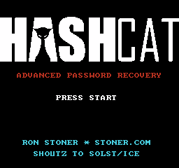
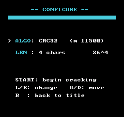
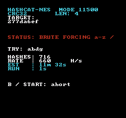
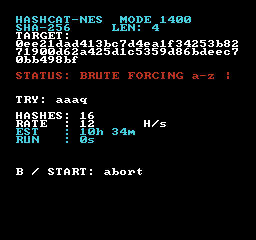
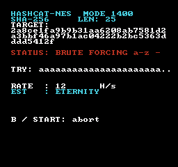
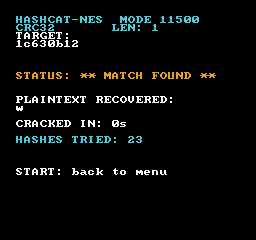

# hashcat-nes

A password "cracker" for the **Nintendo Entertainment System** based on [hashcat](https://hashcat.net) and solst/ICE's [gba-hashcat](https://github.com/solst-ice/gba-hashcat). It boots to the real hashcat logo, lets you pick a hash algorithm and a password length, and then brute-forces `a`–`z` on a 1.79 MHz 6502 until it recovers the plaintext complete with a triumphant fanfare when it lands a match.

It is, as intended, gloriously useless. But every hash it computes is real.

<p align="center">
  
  
  
  
  
  
</p>

## Why brute force (and not a dictionary)?

Most dictionaries won't fit an NES cartridge, and a static list isn't much to look at. Brute force needs zero embedded data. Short lengths crack in seconds and the big ones run until the heat death of the universe.

## Five real hashcat modes

The menu shows each algorithm's actual hashcat `-m` number. All are computed for real; measured throughput on NTSC hardware (H/s = candidate hashes per second):

| Mode | `-m` | Algorithm | ~NES speed | vs. password length |
|------|-----:|-----------|-----------:|---------------------|
| MD5  | 0    | MD5             | ~15 H/s  | flat to 55 chars; halves at 100 |
| SHA1 | 100  | SHA-1           | ~20 H/s  | flat to 55 chars; halves at 100 |
| SHA-256 | 1400 | SHA-256      | ~12 H/s  | flat to 55 chars; ~6 H/s at 100 |
| NTLM | 1000 | MD4(UTF-16LE)   | ~24 H/s  | flat to 27 chars; ~11 H/s at 50 |
| CRC32 | 11500 | CRC-32 (IEEE)  | ~660 H/s | scales with length: ~1000 (2) / 660 (4) / 540 (8) / 300 (25) |

Same methods as the real hashcat just single-threaded on a 1.79 MHz CPU instead of thousands of GPU cores.

## Controls

- **Title:** `START`
- **Menu:** `←/→` change value, `↑/↓` move between Algo / Length, `START` begins, `B` back
- **Cracking:** `B` or `START` aborts back to the menu
- **Victory:** `START` returns to the menu

The cracker picks a random secret of the chosen length, hashes it to make the target, then grinds candidates until one produces the same digest. The recovered plaintext shown on the win screen is the actual candidate that matched.

The cracking screen shows a live odometer, real hashes/sec, elapsed time (**RUN**) and an estimated time to exhaust the keyspace (**EST**) which reads `> 100 YEARS` or `ETERNITY` for the big lengths, since `26^len` outruns even a 64-bit counter past 13 characters. On a match it reports **CRACKED IN** and the total hashes tried, flashes the screen, and color-cycles the banner while the victory sound plays.

## Build

Requires the llvm-mos toolchain and Python with Pillow (for logo to CHR conversion).

```sh
make                 # -> build/hashcat.nes (NROM, 32K PRG + 8K CHR)
make test            # host-side hash test vectors
LLVM_MOS=/path/to/llvm-mos make   # override toolchain location
```

## Layout

```
src/
  main.c      iNES header + entry
  scenes.c    title / menu / crack / victory state machine
  hash.c      dispatch over the five modes (+ NTLM's UTF-16LE)
  md.c        MD4 + MD5      
  sha1.c      SHA-1     
  sha256.c    SHA-256
  crc32.c     CRC-32       
  brute.c     a-z odometer  sound.c  APU engine
  text.c      nametable + VRAM-update-buffer helpers
  chr.c, gen_title.h   GENERATED by tools/gen_chr.py
tools/
  gen_chr.py, 
  font8x8_basic.h, 
  hashtest.c
references/  
  hashcatlogo.png
```

## Credits

- Inspired by **GBA-Hashcat** and the real [**hashcat**](https://hashcat.net)
- Font: `font8x8` by Daniel Hepper (public domain, IBM VGA lineage)
- hashcat name/logo belong to the hashcat project; used here in fan tribute
- neslib: https://github.com/clbr/neslib
